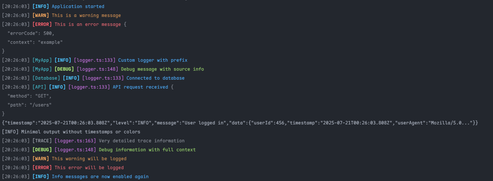

# @calphonse/logger

> A beautiful, intelligent, and secure logger for Node.js with AI-powered error analysis

<p align="center">
  <a href="https://www.npmjs.com/package/@calphonse/logger">
    
  </a>
  <a href="https://www.typescriptlang.org/">
    
  </a>
  <a href="https://nodejs.org/">
    
  </a>
  
  
</p>

## Why This Logger?

Tired of `console.log` chaos? This logger transforms your debugging experience with:

- **Beautiful colored output** - Easy to read and visually organized
- **Structured logging** - JSON support with rich context
- **AI-powered error analysis** - Intelligent error insights and suggestions
- **Enterprise-grade security** - Input validation, sanitization, and protection
- **Zero performance impact** - Async logging that won't slow your app
- **Developer-friendly** - Works great out of the box, highly configurable
- **TypeScript first** - Full type safety and excellent IntelliSense
- **Production-ready** - Hardened against common security vulnerabilities



## Installation

```bash
npm install @calphonse/logger
# or
pnpm add @calphonse/logger
# or
yarn add @calphonse/logger
```

## Quick Start

```typescript
import { logger } from '@calphonse/logger';

// Basic usage - just like console.log but better!
logger.info('Application started');
logger.warn('High memory usage detected');
logger.error('Something went wrong', { error: 'details' });

// Structured logging with context
logger.info('User login attempt', {
  userId: '12345',
  method: 'email',
  ipAddress: '192.168.1.100',
  timestamp: new Date().toISOString(),
});

// AI will automatically analyze errors!
try {
  throw new Error('Database connection failed');
} catch (error) {
  logger.error('Database error', error); // Gets AI analysis automatically
}
```

## AI-Powered Error Analysis

Get intelligent error insights automatically:

```typescript
import { logger } from '@calphonse/logger';

// Errors get automatic AI analysis
logger.error('User authentication failed', new Error('Invalid JWT token'));

// Output includes AI suggestions:
// AI Insight:
//    Explanation: JWT token validation failed
//    Likely Causes: Expired token, Invalid signature, Missing secret key
//    Suggested Fix: Check token expiration and verify JWT secret configuration
//    Context: Common in authentication middleware, verify environment variables
```

### Setting up AI Analysis

```bash
# Install Ollama (free, local AI)
curl -fsSL https://ollama.ai/install.sh | sh
ollama pull llama3.2:3b

# Or configure cloud AI providers
pnpm setup-ai  # Interactive setup wizard
```

## Features

### Beautiful Terminal Output

```typescript
import { logger } from '@calphonse/logger';

logger.info('Server starting on port 3000');
logger.warn('Database connection slow');
logger.error('Failed to process request', {
  requestId: 'req-123',
  error: 'Connection timeout',
});
```

**Output:**

```
[14:30:25] [INFO] Server starting on port 3000
[14:30:26] [WARN] Database connection slow
[14:30:27] [ERROR] Failed to process request {
  "requestId": "req-123",
  "error": "Connection timeout"
}
```

### Structured JSON Logging

```typescript
import { LoggerFactory } from '@calphonse/logger';

const jsonLogger = LoggerFactory.createJsonLogger();

jsonLogger.info('User action', {
  action: 'login',
  userId: '12345',
  timestamp: new Date().toISOString(),
  metadata: {
    userAgent: 'Mozilla/5.0...',
    ipAddress: '192.168.1.100',
  },
});
```

### Child Loggers for Context

```typescript
import { logger } from '@calphonse/logger';

// Create child loggers for different components
const userLogger = logger.child('[USER]');
const dbLogger = logger.child('[DATABASE]');
const apiLogger = logger.child('[API]');

userLogger.info('User created', { userId: '123' });
dbLogger.info('Query executed', { query: 'SELECT * FROM users' });
apiLogger.info('Request processed', { endpoint: '/api/users' });
```

### Flexible Configuration

```typescript
import { Logger, LogLevel } from '@calphonse/logger';

const customLogger = new Logger({
  level: LogLevel.DEBUG, // Set minimum log level
  timestamps: true, // Include timestamps
  colors: true, // Enable colored output
  showSource: true, // Show file/line information
  prefix: '[MY-APP]', // Custom prefix
  json: false, // Text output (not JSON)
  timestampFormat: 'HH:mm:ss.SSS', // Custom timestamp format
});
```

### Factory Methods

```typescript
import { LoggerFactory } from '@calphonse/logger';

// Pre-configured loggers for common use cases
const jsonLogger = LoggerFactory.createJsonLogger();
const minimalLogger = LoggerFactory.createMinimalLogger();
const verboseLogger = LoggerFactory.createVerboseLogger();
```

## Security Features

This logger is hardened against common security vulnerabilities:

### Input Validation & Sanitization

- **Configuration validation** - Prevents malicious config injection
- **AI prompt sanitization** - Protects against prompt injection attacks
- **Output stream validation** - Validates custom output destinations
- **File size limits** - Prevents DoS attacks via large config files

### Secure Defaults

- **Safe configuration loading** - Validates and sanitizes all config inputs
- **Prototype pollution protection** - Prevents malicious object manipulation
- **Memory limits** - Bounded input sizes to prevent resource exhaustion

### Best Practices

```typescript
// Good: Use validated loggers
const logger = new Logger({
  output: process.stdout, // Validated stream
});

// Good: The logger sanitizes all inputs automatically
logger.error('User input error', {
  userInput: '<script>alert("xss")</script>', // Automatically sanitized
});

// Good: AI analysis is protected against injection
logger.error('Database error', new Error('DROP TABLE users')); // Safe to analyze
```

## API Reference

### Core Methods

```typescript
// Log levels (in order of severity)
logger.error(message: string, data?: any): void
logger.warn(message: string, data?: any): void
logger.info(message: string, data?: any): void
logger.debug(message: string, data?: any): void
logger.trace(message: string, data?: any): void

// Configuration
logger.setLevel(level: LogLevel): void
logger.setConfig(config: Partial<LoggerConfig>): void
logger.getConfig(): LoggerConfig
logger.isEnabled(level: LogLevel): boolean

// Child loggers
logger.child(prefix: string): Logger

// AI Features
logger.analyzeError(error: Error): Promise<ErrorAnalysis>
logger.getInsight(error: Error): Promise<AIInsight | null>
logger.isAIHealthy(): Promise<boolean>
```

### Factory Methods

```typescript
import { LoggerFactory } from '@calphonse/logger';

// Create specialized loggers
LoggerFactory.createJsonLogger(config?: Partial<LoggerConfig>): Logger
LoggerFactory.createMinimalLogger(config?: Partial<LoggerConfig>): Logger
LoggerFactory.createVerboseLogger(config?: Partial<LoggerConfig>): Logger
```

### Log Levels

```typescript
enum LogLevel {
  ERROR = 0, // Only errors
  WARN = 1, // Warnings and errors
  INFO = 2, // Info, warnings, and errors (default)
  DEBUG = 3, // Debug, info, warnings, and errors
  TRACE = 4, // Everything
}
```

### Configuration Options

```typescript
interface LoggerConfig {
  level?: LogLevel; // Minimum log level
  timestamps?: boolean; // Include timestamps
  colors?: boolean; // Enable colored output
  timestampFormat?: string; // Timestamp format
  showSource?: boolean; // Show file/line info
  prefix?: string; // Custom prefix
  json?: boolean; // JSON output format
  output?: NodeJS.WritableStream; // Custom output stream (validated)
  ai?: Partial<AIConfig>; // AI configuration
}

interface AIConfig {
  enabled: boolean; // Enable AI features
  provider: 'ollama' | 'openai' | 'disabled'; // AI provider
  caching: boolean; // Cache AI responses
  timeout: number; // Request timeout
  confidenceThreshold: ConfidenceLevel; // Minimum confidence level
}
```

## Use Cases

### Express.js Middleware with AI Analysis

```typescript
import express from 'express';
import { logger } from '@calphonse/logger';

const app = express();

// Request logging middleware
app.use((req, res, next) => {
  const start = Date.now();

  res.on('finish', () => {
    const duration = Date.now() - start;
    logger.info('Request completed', {
      method: req.method,
      url: req.url,
      status: res.statusCode,
      duration: `${duration}ms`,
      userAgent: req.get('User-Agent'),
    });
  });

  next();
});

// Error handling with AI analysis
app.use((err, req, res, next) => {
  logger.error('Request failed', err); // AI automatically analyzes the error
  res.status(500).json({ error: 'Internal server error' });
});
```

### Enhanced Error Handling

```typescript
import { logger } from '@calphonse/logger';

process.on('uncaughtException', error => {
  logger.error('Uncaught Exception', {
    error: error.message,
    stack: error.stack,
    timestamp: new Date().toISOString(),
  });
  // AI provides insights about the crash
  process.exit(1);
});

process.on('unhandledRejection', (reason, promise) => {
  logger.error('Unhandled Rejection', {
    reason: reason,
    promise: promise,
    timestamp: new Date().toISOString(),
  });
  // AI analyzes promise rejection patterns
});
```

### Database Operations with Intelligence

```typescript
import { logger } from '@calphonse/logger';

const dbLogger = logger.child('[DATABASE]');

async function createUser(userData) {
  const start = Date.now();

  try {
    dbLogger.info('Creating user', { email: userData.email });

    const user = await db.users.create(userData);

    const duration = Date.now() - start;
    dbLogger.info('User created successfully', {
      userId: user.id,
      duration: `${duration}ms`,
    });

    return user;
  } catch (error) {
    const duration = Date.now() - start;
    // AI automatically analyzes database errors and suggests fixes
    dbLogger.error('Failed to create user', {
      email: userData.email,
      error: error.message,
      duration: `${duration}ms`,
    });
    throw error;
  }
}
```

### Table Data Logging

```typescript
import { logger } from '@calphonse/logger';

const users = [
  { id: 1, name: 'Alice', role: 'Admin' },
  { id: 2, name: 'Bob', role: 'User' },
  { id: 3, name: 'Charlie', role: 'Moderator' },
];

// Display data in a beautiful table format
logger.table(users);
logger.table(LogLevel.DEBUG, users, { border: false });
```

## Development

### Setup

```bash
# Clone the repository
git clone https://github.com/ChristopherAlphonse/logger.git
cd logger

# Install dependencies
pnpm install

# Start development mode
pnpm dev

# Run tests
pnpm test

# Run quality checks
pnpm quality
```

### Available Scripts

- `pnpm dev` - Development mode with watch
- `pnpm build` - Build the project
- `pnpm test` - Run tests
- `pnpm test:watch` - Run tests in watch mode
- `pnpm test:coverage` - Run tests with coverage
- `pnpm lint` - Check for linting issues
- `pnpm format` - Format code
- `pnpm quality` - Run all quality checks
- `pnpm example:basic` - Run basic usage example
- `pnpm example:error` - Run error handling example
- `pnpm example:ai-demo` - Run AI-powered demo
- `pnpm setup-ai` - Setup AI configuration

### Security Development

We follow security-first development practices:

- **Input validation** on all user-provided data
- **Sanitization** of all outputs sent to external services
- **Safe defaults** in all configuration options
- **Regular security audits** with `pnpm audit`
- **Dependency updates** to patch known vulnerabilities

## Contributing

We welcome contributions! Please see our [Contributing Guide](CONTRIBUTING.md) for details.

### Development Workflow

1. Fork the repository
2. Create a feature branch
3. Make your changes
4. Add tests for new functionality
5. Run quality checks: `pnpm quality`
6. Ensure security standards: `pnpm audit`
7. Submit a pull request

### Security Guidelines

When contributing:

- Validate all inputs
- Sanitize outputs to external services
- Add security tests for new features
- Follow the principle of least privilege
- Document security considerations

## License

MIT License - see [LICENSE](LICENSE) file for details.

## Changelog

### v1.1.0 - Security & AI Release

#### Security Enhancements

- **Added input validation** for all configuration files
- **Added sanitization** for AI prompts and outputs
- **Added protection** against prototype pollution attacks
- **Added validation** for output streams to prevent injection
- **Added rate limiting** and resource bounds

#### AI Features

- **AI-powered error analysis** with multiple provider support
- **Intelligent error insights** and fix suggestions
- **Framework-aware analysis** (React, Node.js, Express, etc.)
- **Caching system** for improved performance
- **Configurable confidence thresholds**

#### Code Quality

- **Removed deprecated methods** (use LoggerFactory instead)
- **Eliminated code duplication** and dead code
- **Improved TypeScript support** with better type safety
- **Enhanced test coverage** with 119 passing tests
- **Better error handling** with graceful fallbacks

#### Performance

- **Optimized bundle size** with proper externalization
- **Improved build process** with better dependency management
- **Reduced memory footprint** with efficient caching
- **Better tree-shaking** support for smaller bundles

## Roadmap

Exciting features coming soon:

- **Advanced Analytics** - Log pattern analysis and insights
- **Performance Monitoring** - Built-in performance metrics
- **Framework Integrations** - Express, Fastify, NestJS plugins
- **Cloud Integrations** - AWS CloudWatch, Google Cloud Logging
- **Smart Filtering** - AI-powered log filtering and search
- **Mobile Support** - React Native compatibility

## Acknowledgments

- Built with [Chalk](https://github.com/chalk/chalk) for beautiful terminal colors
- AI powered by [Ollama](https://ollama.ai/) and [OpenAI](https://openai.com/)
- Security hardened following OWASP guidelines
- Inspired by the need for better debugging tools in Node.js

---

**Made with love and AI for the Node.js community**

If this logger helps you debug faster and more securely, please give it a star on GitHub!
